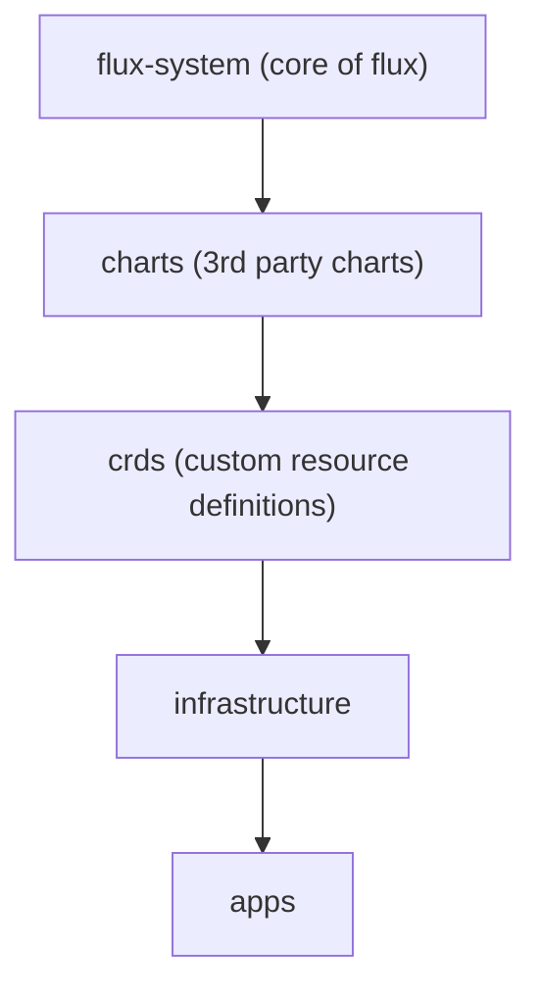

# Flux dependency hierarchy

```mermaid
flowchart TD;
    A["flux-system (core of flux)"]-->B["charts (3rd party charts)"]
    B-->C["crds (custom resource definitions)"];
    C-->D[infrastructure];
    D-->E[apps];
```
