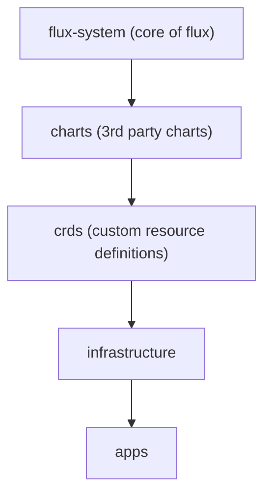

# Usage

This is intended to be:
- run on a single-node cluster
- executed on the single node (you'll need sudo access)
- run on amd64 hardware

Start by cloning the repo, editing the `.env` file, and bootstrapping the cluster (installing K3s, Helm, etc...).

## Setup

```
git clone https://github.com/loganmarchione/k8s_homelab.git
cd k8s_homelab/scripts
cp -p .env_sample .env
vim .env
#MAKE YOUR CHANGES IN THE .env FILE
```

Next, you need to create a series of secrets

```
kubectl create secret generic cluster-secret-vars \
  --namespace=flux-system \
  --from-literal=SECRET_INTERNAL_DOMAIN_NAME=your.domain.com \
  --from-literal=SECRET_LETS_ENCRYPT_EMAIL=name@email.com \
  --from-literal=SECRET_AWS_REGION=us-east-1
```

Bootstrap the cluster

```
./01-setupMasterNode.sh
```

## Verification

Flux bootstraps in the order below.



Wait a few minutes, then then run the command below (hopefully all will show `True`).

```
kubectl get kustomization -n flux-system
```

If you need to give it a kick in the ass, use this.

```
flux reconcile source git flux-system
```

After a few minutes, make sure that Let's Encrypt registered a `secret` and `ClusterIssuer` for both `production` and `staging`.

```
kubectl get secret --all-namespaces
kubectl get clusterissuer -n cert-manager
```
