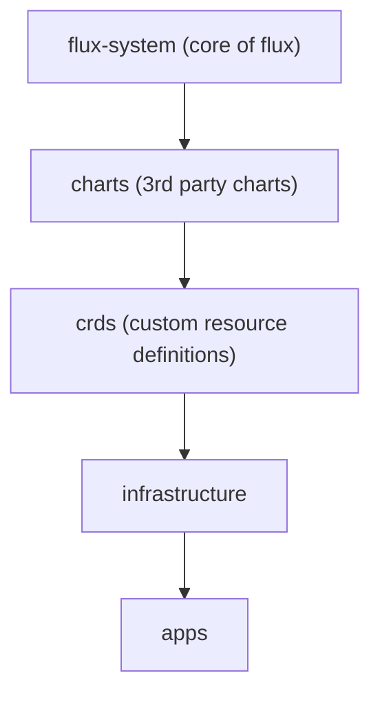

# Usage

This is intended to be:
- run on a single-node cluster
- executed on the single node (you'll need sudo access)
- run on amd64 hardware

Start by cloning the repo, editing the `.env` file, and bootstrapping the cluster (installing K3s, Helm, etc...).

## Setup

Starting by cloning the repo, editing a few variables, and then installing K3s.

```
git clone https://github.com/loganmarchione/k8s_homelab.git
cd k8s_homelab/scripts
cp -p .env_sample .env
vim .env
#MAKE YOUR CHANGES IN THE .env FILE
./01-setupMasterNode.sh
```

At this point, you should be able to run the commands below.

```
export KUBECONFIG=$HOME/.kube/config
kubectl get nodes -o wide
```

Next, create a namespace for Flux, as well as series of secrets.

```
kubectl create namespace flux-system --dry-run=client -o yaml | kubectl apply -f -
kubectl create secret generic cluster-secret-vars \
  --namespace=flux-system \
  --from-literal=SECRET_INTERNAL_DOMAIN_NAME=your.domain.com \
  --from-literal=SECRET_LETS_ENCRYPT_EMAIL=name@email.com \
  --from-literal=SECRET_AWS_REGION=region-here-1
kubectl describe secret cluster-secret-vars -n flux-system
```

Bootstrap Flux

```
./02-flux.sh
```

## Verification

### Flux

Flux bootstraps in the order below (based off of the [dependencies](https://fluxcd.io/flux/components/kustomize/kustomization/#kustomization-dependencies) I've setup).



Wait a few seconds, then run the command below (it will take a few minutes for everything to show `True`).

```
kubectl get kustomization -n flux-system
```

If you need to give it a kick in the ass, use this.

```
flux reconcile source git flux-system
```

### cert-manager

After a few minutes, make sure that Let's Encrypt registered a `ClusterIssuer` and `secret` for both `production` and `staging`.

```
kubectl get clusterissuer -n cert-manager
kubectl get secret -n cert-manager
```

A few minutes, you should see certificates appear (it will take a few minutes for everything to show `True`/`valid`).

```
kubectl get certificaterequest -n cert-manager
kubectl get order -n cert-manager
kubectl get challenges -n cert-manager
kubectl get certificate -n cert-manager
```
